# 📒 인덱싱 최적화 개발노트

## 📚 목차
- [1. 🔍 검색 환경 분석](#1--검색-환경-분석)
- [2. 🏗️ 초기 검색 환경 구성](#2--초기-검색-환경-구성)
  - [2.1 🌳 B-Tree 및 B+Tree](#21--b-tree-및-btree)
  - [2.2 ⚙️ 현재 DB의 동작 방식](#22--현재-db의-동작-방식)
  - [2.3 🔡 검색 키워드 "LIKE" 도입](#23--검색-키워드-like-도입)
- [3. 📈 Full-Text 인덱싱 도입](#3--full-text-인덱싱-도입)
  - [3.1 🧠 Full-Text 인덱스의 동작 원리](#31--full-text-인덱스의-동작-원리)
  - [3.2 📊 Full-Text 인덱스 특징](#32--full-text-인덱스-특징)
  - [3.3 🛠️ MySQL에서의 Full-Text 인덱스 구현](#33--mysql에서의-full-text-인덱스-구현)
  - [3.4 🔎 Full-Text 검색 모드](#34--full-text-검색-모드)
  - [3.5 🧪 성능 비교 분석](#35--성능-비교-분석)
  - [3.6 ⚠️ Full-Text 인덱스의 한계](#36--full-text-인덱스의-한계)
  - [3.7 MySQL의 n-gram 파서](#37-mysql의-n-gram-파서)
- [4. 🧬 대규모 데이터 환경에서의 검색 전략](#4--대규모-데이터-환경에서의-검색-전략)
  - [4.1 🤔 검색 엔진 도입 고려사항](#41--검색-엔진-도입-고려사항)
- [5. ✅ 결론](#5--결론)
  - [5.1 📝 결론](#51--결론)

---

## 1. 🔍 검색 환경 분석

현재 검색은 게시글의 **제목**과 **내용**에서 사용자가 입력한 키워드를 기준으로 검색되며, 키워드는 문자열 어디에 포함되어도 검색되어야 한다.

🧾 **요구사항**
- 키워드는 문자열 내 어느 위치에 존재해도 검색되어야 함
- 제목과 내용 필드 모두에서 검색이 이루어져야 함
- 10만 건 이상의 데이터에서도 합리적인 응답 시간 보장

---

## 2. 🏗️ 초기 검색 환경 구성

### 2.1 🌳 B-Tree 및 B+Tree

#### 📘 B-Tree
- 균형 이진 탐색 트리로, 삽입/삭제/검색 성능이 O(log n)
- 디스크 I/O 최소화를 위해 설계됨
- 내부 노드와 리프 노드 모두에 데이터 저장 가능

#### 📗 B+Tree
- B-Tree의 확장 구조
- **모든 데이터는 리프 노드에만 저장**
- **리프 노드 간 연결**되어 범위 검색에 유리
- MySQL InnoDB의 기본 인덱스 구조로 채택됨

### 2.2 ⚙️ 현재 DB의 동작 방식

- 🔑 **프라이머리 키**: 클러스터드 인덱스로 저장
- 🗂️ **보조 인덱스**: 넌클러스터드 인덱스
- ✅ **선택성 높은 컬럼**에 인덱스가 효과적
- ⚠️ `%keyword%` 패턴 검색은 **인덱스 미사용 → 전체 테이블 스캔 발생**

### 2.3 🔡 검색 키워드 "LIKE" 도입

#### ❌ 문제점
- `LIKE '%keyword%'`는 **B+Tree 인덱스 비활용**
- 전체 테이블 스캔 발생으로 **검색 성능 저하**

#### 🧪 성능 측정 결과
| 데이터 수           | 평균 소요 시간 |
|-----------------|----------|
| 10,000건         | 약 0.8초   |
| 100,000건        | 약 1.7초   |
| 1,000,000건 (예상) | 5초 이상    |

#### 💡 대안 검토
1. 접두사 검색 (`LIKE 'keyword%'`) → 인덱스 사용 가능하지만 범위 제한
2. 함수 기반 인덱스 → 구현 복잡도 증가
3. **Full-Text 인덱스 도입** → 텍스트 검색에 최적화된 구조

---

## 3. 📈 Full-Text 인덱싱 도입

### 3.1 🧠 Full-Text 인덱스의 동작 원리

1. **토큰화(Tokenization)**
  - 텍스트 내용을 의미 있는 단위(토큰)로 분리
    - 단어 분리: 공백, 구두점 등을 기준으로 텍스트를 개별 단어로 분리
    - 불용어 제거: 'a', 'the', 'is'와 같이 검색에 큰 의미가 없는 단어 제외
    - 어간 추출: 'running', 'runs', 'ran'을 'run'으로 통일하는 작업
    - 대소문자 변환: 보통 모두 소문자로 변환하여 저장

2. **역인덱스 구축**
  - 토큰화된 각 단어에 대해 해당 단어가 등장하는 문서(또는 레코드) ID를 매핑
   ```
   단어1 -> 문서ID_1, 문서ID_3, 문서ID_7
   단어2 -> 문서ID_2, 문서ID_5
   단어3 -> 문서ID_1, 문서ID_5, 문서ID_9
   ```
  - 이렇게 구축된 역인덱스는 특정 단어가 포함된 모든 문서를 빠르게 찾을 수 있게 해줌

3. **단어 위치 및 빈도 정보 저장**
  - 고급 Full-text 인덱스는 단어의 위치 정보와 빈도수도 함께 저장
   ```
   단어1 -> (문서ID_1: 위치[1,15,42], 빈도=3), (문서ID_3: 위치[7], 빈도=1)...
   ```
  - 이 정보는 검색 결과 순위 결정(Ranking)과 근접 검색(Proximity Search)에 활용됨

4. **검색 과정**
  - 검색어가 입력되면 다음 과정을 거침
    - 검색어 처리: 인덱스 구축 때와 동일한 토큰화, 불용어 제거, 어간 추출 적용
    - 역인덱스 조회: 처리된 검색어로 역인덱스를 조회하여 관련 문서 ID 확인
    - 결과 조합: 여러 단어 검색 시 각 단어별 결과를 AND, OR, NOT 등의 논리 연산으로 조합
    - 순위 결정: TF-IDF(Term Frequency-Inverse Document Frequency) 등의 알고리즘으로 관련성 점수 계산

5. **검색 연산 모드**
  - 대부분의 Full-text 검색 엔진은 여러 검색 모드를 지원
    - 자연어 모드(Natural Language Mode): 일반적인 질의 처리, 관련성 기반 순위 부여
    - 불린 모드(Boolean Mode): AND, OR, NOT 등의 연산자를 지원하는 복잡한 쿼리 가능
    - 쿼리 확장 모드(Query Expansion Mode): 원래 검색어 관련 단어까지 확장하여 검색

### 3.2 📊 Full-Text 인덱스 특징

- 🧾 **역인덱스(Inverted Index)** 구조
- 🧠 텍스트 분석 기능 포함:
  - 🧹 불용어 제거
  - ✂️ 어간 추출
  - 🔠 토큰화
- 위치와 무관한 **단어 단위 검색**
- 📊 관련성 점수 기반 **검색 결과 순위화**
- 🔎 일반 인덱스보다 **텍스트 검색에 최적화**
- 🚀 검색 정확도와 성능 모두 향상

### 3.3 🛠️ MySQL에서의 Full-Text 인덱스 구현

```sql
-- 인덱스 추가
ALTER TABLE post ADD FULLTEXT INDEX ft_title_content (title, content);

-- 자연어 모드 검색
SELECT * FROM post
WHERE MATCH(title, content) AGAINST('게임 전략' IN NATURAL LANGUAGE MODE);

-- Boolean 모드 검색
SELECT * FROM post
WHERE MATCH(title, content) AGAINST('+게임 -캐주얼' IN BOOLEAN MODE);
```

⚙️ **JPA 엔티티 설정**

```java
@Entity
@Table(name = "post", indexes = {
    @Index(name = "idx_post_fulltext", columnList = "title,content", unique = false)
})
public class Post {
    // 기존 필드...
}
```

⚠️ **주의사항**
- 기본 최소 검색 단어 길이: 4자 (한글은 2자로 설정하는 것이 좋음)
- 한글 지원 시 n-gram 파서 설정 고려
- InnoDB는 MySQL 5.6 이상부터 Full-Text 인덱스 지원

### 3.4 🔎 Full-Text 검색 모드

| 모드            | 설명                              | 사용 사례                  |
|---------------|---------------------------------|------------------------|
| 🧠 자연어 모드     | 관련성 기반 자동 순위화, 직관적인 검색          | 일반 검색, 관련성 기반 정렬 필요 시  |
| ⚙️ Boolean 모드 | `+`, `-`, `"..."`, `*` 등 연산자 지원 | 복잡한 조건 검색, 특정 단어 포함/제외 |
| 🌐 쿼리 확장 모드   | 검색어 관련 단어로 결과 확장                | 검색 결과 확장 필요 시          |

#### 자연어 모드 vs Boolean 모드 동작 차이

**자연어 모드**
- 검색어를 토큰화하여 자연스러운 검색 처리
- 관련성 점수가 높은 순으로 정렬
- 검색 결과가 최상위 문서의 50% 미만 관련성을 가진 경우 제외 (기본 설정)

**Boolean 모드**
- 특수 연산자를 통해 검색 조건 세밀하게 제어
- 와일드카드(`*`) 지원으로 접두어 검색 가능
- 불용어도 검색 가능 (`+` 연산자 사용 시)
- 50% 규칙 적용되지 않음 (모든 일치 결과 반환)

### 3.5 🧪 성능 비교 분석

데이터 10만 건 기준 검색 시간 1s 내외의 성능 달성
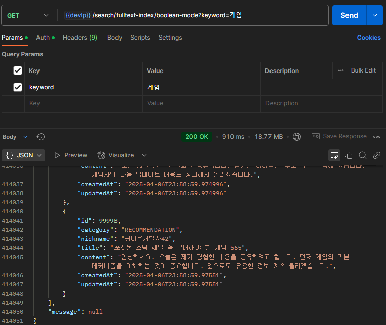

📈 **예상 효과**
- 전체 검색 속도 **대폭 향상** (LIKE 검색 대비 5-10배 예상)
- 대용량에서도 **일관된 성능 유지**
- 검색 정확도 향상
- DB 서버 부하 감소

### 3.6 ⚠️ Full-Text 인덱스의 한계

1. **언어 지원 제한**:
  - MySQL, PostgreSQL의 기본 Full-text 기능은 영어 중심으로 설계됨
  - 한국어, 일본어, 중국어 같은 비공백 기반 언어에 대한 분석 기능이 제한적

2. **확장성 문제**:
  - 대량의 데이터나 고빈도 검색 요청에서 성능 저하
  - 샤딩(sharding)과 같은 수평적 확장성 기능이 제한적

3. **검색 기능의 제한**:
  - 퍼지 검색(fuzzy search), 오타 교정 등 고급 검색 기능 부족
  - 복잡한 검색 쿼리나 필터링 표현의 한계

4. **실시간 업데이트 제한**:
  - 대량의 데이터 변경 시 인덱스 업데이트 부하가 큼
  - 실시간 인덱싱이 제한적

5. **랭킹 알고리즘 제한**:
  - 기본적인 관련성 점수 계산은 가능하나, 세밀한 조정이 어려움
  - 맥락 기반 랭킹이나 사용자 행동 기반 랭킹 구현이 제한적

### 3.7 MySQL의 n-gram 파서

#### ❓n-gram 파서란?

n-gram은 연속된 n개의 문자 시퀀스를 기반으로 텍스트를 토큰화하는 방식이다. 예를 들어, "안녕하세요"를 2-gram(bigram)으로 처리하면:
- "안녕", "녕하", "하세", "세요"로 분리

이 방식은 형태소 분석 없이도 한국어 검색에 어느 정도 효과적이다.


#### 🔎 n-gram 파서 장점
`🧪 성능 측정 결과`
    
1. **부분 단어** 검색
   - 텍스트를 n개 문자 단위로 분리하므로 단어의 일부만 입력해도 검색이 가능
2. **조사/어미** 사용 언어에 적합함 
   - 1번의 이유로 국어의 "그라운디드가", "그라운디드라고" 등 조사가 붙은 형태도 쉽게 검색 가능
3. **띄어쓰기**에 유연
   - 사용자가 띄어쓰기를 잘못하더라도 검색 결과를 찾을 수 있음

- 👇 `n-gram 사용 전` / **부분 단어 검색 불가능**
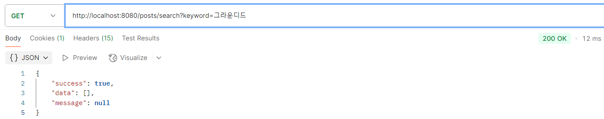
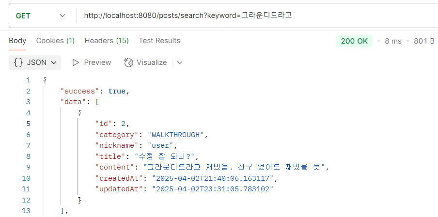
      
- 👇 `n-gram 사용 후` / **부분 단어 검색 가능, 조사 사용·띄어쓰기 사용에 유연함**
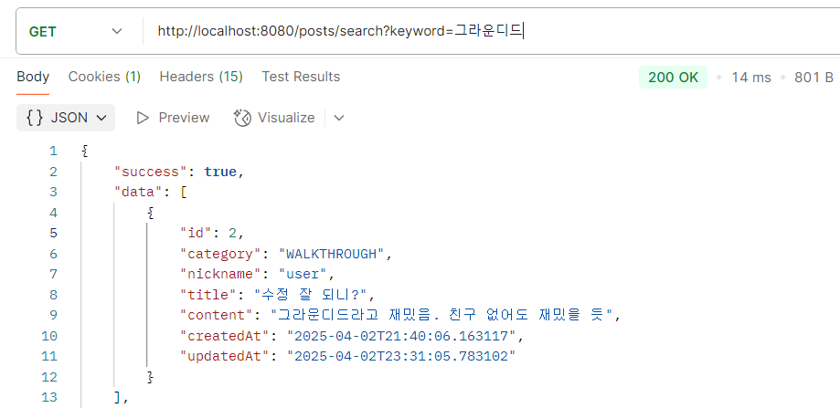
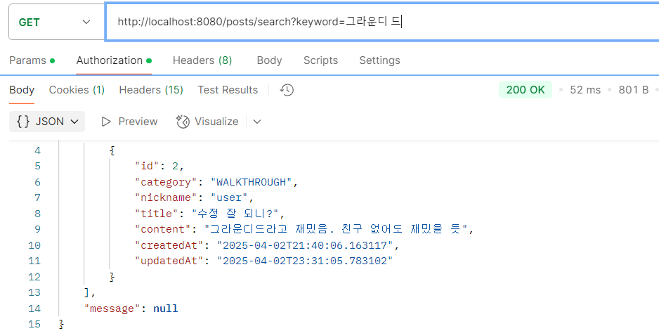

#### 🔎 n-gram 파서 단점

`✍️n-gram = 2`


`🧪 성능 측정 결과`

1. 데이터 크기에 비례하여 **인덱스 증가**
   - 👇 게시물 `10만개` 인덱스 크기
   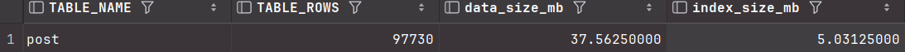
   - 👇 게시물 `100만개` 인덱스 크기
   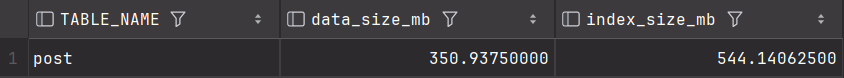


2. **오탐** 증가, **관련성 점수 정확도** 감소
     - 원인: 의미 단위가 아닌 문자 단위로 분리
     - 결과: 의도하지 않은 결과 반환, 관련성 점수의 정확도가 떨어짐
     - 👇 `듀벨`로 검색 → `스타듀벨리`, `듀벨의 검` 반환
     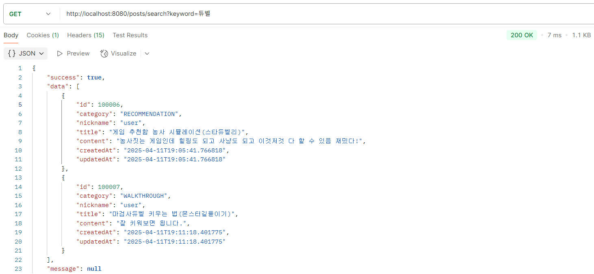
     - 👇 `위치`로 검색 → `위치잇`, `보물 위치` 반환
     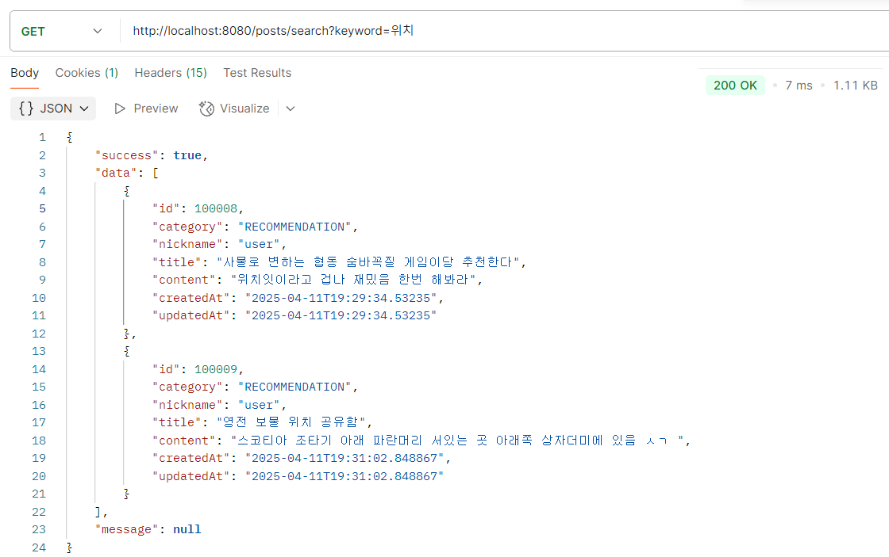
   

3. **데이터 증가** 시 급격한 **검색 속도 저하**
    - 원인:
      - 데이터 증가에 따른 저장할 토큰(n-gram) 수가 급격히 증가함 
      - 각 토큰마다 연결된 문서 정보가 많아짐 
      - 색인이 너무 커서 메모리에 다 들어가지 못하고 디스크 접근이 필요해짐 
      - 검색 시 확인해야 할 후보 문서가 많아짐
      
    - 👇 `포켓몬`으로 검색 / 게시물 `10만` / `163ms`
     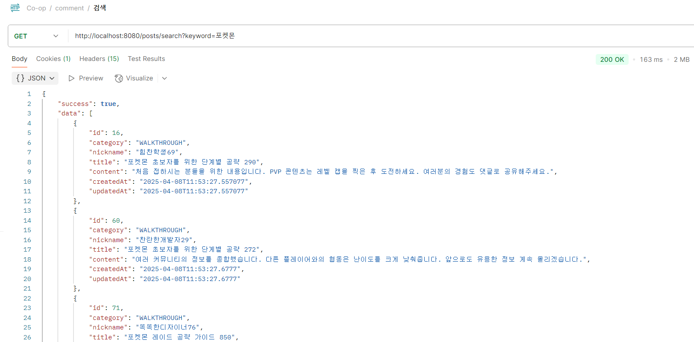
    - 👇 `포켓몬`으로 검색 / 게시물 `100만` / `5.26s`
     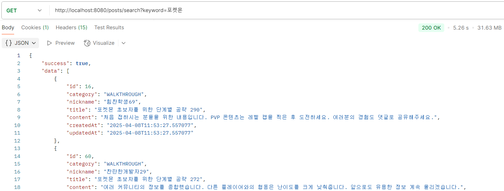
    - 👇 `그라운디드`로 검색 / 게시물 `10만` / `12ms` 
     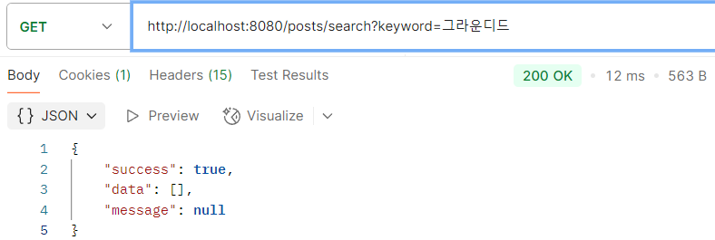
    - 👇 `그라운디드`로 검색 / 게시물 `100만` / `90ms` 
     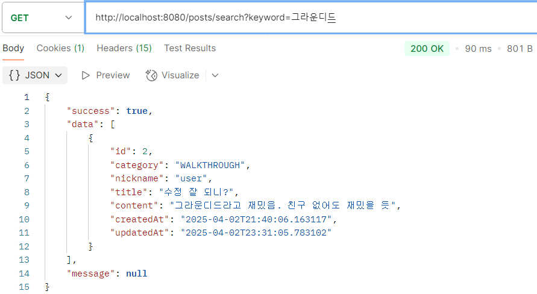

---

#### 최적의 선택?
**n-gram**을 도입하게 되면 게시글 하나가 작성되는 순간 작지 않은 크기의 인덱스가 생성된다.  
사이트의 사용자 수가 적지 않음을 고려하여 게시물을 10만, 50만, 100만개로 순차적으로 증가시켜 테스트를 진행했다.  
예상했던 대로 데이터 수가 증가하면서 인덱스도 증가했고, 검색 속도도 저하되었다.  
하나의 더미데이터 생성기로 게시물을 50만개까지 만들어 중복이 발생했음에도, 인덱스 사이즈가 100배 증가했다.  
중복이 없는 상황에선 더 가파르게 증가할 것이며 검색속도 감소도 그에 비례할 것이다.

검색의 결과는 정확도가 우선시 되어야 하며 검색 속도도 중요하다.  
이 두 영역에서 n-gram은 부적합하다.

따라서 n-gram보다는 full-text인덱스 전략을 사용하며 자연어 모드 + Boolean 모드를 혼용하여 정확도를 높이는 것이
현 단계에서는 최적의 선택이라고 생각한다. 하지만 이 선택에도 한국어 검색에서 특히 두드러지는 한계점이 있다.

1. **어간/조사 처리 문제**: "게임의", "게임을", "게임이"를 모두 다른 단어로 인식

<"게임의" 키워드로 검색">

<"게임" 키워드로 검색>
자연어 모드의 경우 "게임"과 "게임의"는 다른 키워드라고 인식하여 검색이 불가능
2. **유의어 처리 불가**: "컴퓨터"와 "PC" 같은 동의어를 연결하지 못함
3. **짧은 검색어 제한**: 2~3글자 검색어(예: "롤", "워") 처리 불가
4. **오타 처리 능력 부재**: 사용자 오타에 취약함

이러한 한계점들은 검색량과 데이터가 증가할수록 더 명확하게 드러날 것이며,
장기적으로는 Elasticsearch와 같은 전문 검색 엔진의 도입이 불가피할 것으로 판단된다.

## 4. 🧬 대규모 데이터 환경에서의 검색 전략

현재 환경이 많은 사용자들이 해당 커뮤니티를 이용하고, 많은 게시글이 쏟아지고 있는 상황이므로,
Full-text 인덱스로는 앞서 언급한 한계점들이 보인다.
이러한 한계를 극복하기 위해서는 어떤 방법이 있을까?
대안으로 내세울만 한 검색 엔진들과 Full-text 인덱스 전략을 비교해 보았다.

### 4.1 🤔 검색 엔진 도입 고려사항

| 구분     | 데이터베이스 Full-Text | Elasticsearch | Apache Solr |
|--------|------------------|---------------|-------------|
| 특징     | 내장 기능, 간단한 구성    | 분산 검색, 실시간 분석 | 고성능 텍스트 분석  |
| 확장성    | 중소 규모 적합         | 대규모 분산 시스템    | 엔터프라이즈 환경   |
| 구현 난이도 | 낮음               | 중간            | 중간~높음       |
| 한국어 지원 | 제한적(n-gram)      | 우수(Nori 분석기)  | 우수(아리랑 분석기) |
| 실시간성   | 제한적              | 우수            | 우수          |
| 오타 교정  | 미지원              | 지원            | 지원          |

🔍 **Elasticsearch 도입 기준**
- 수백만 건 이상 데이터
- 실시간 검색, 오타 보정, 자동완성 등 고급 기능 필요
- 형태소 분석을 통한 정확한 한국어 검색 필요
- 복잡한 검색 결과 랭킹 요구사항
---

## 5. ✅ 결론

### 5.1 📝 결론

- 기존 `LIKE '%keyword%'` 방식은 인덱스 비효율 → 성능 저하
- **Full-Text 인덱스**는 빠른 검색과 관련성 기반 정렬 제공
- 한국어 검색을 위한 전략 필요 -> n-gram 혹은 full-text인덱스 + 검색전략, 하지만 한계가 뚜렷함
- 데이터 규모가 커질수록 **검색 엔진 연동** 필요성 증가
- 단계적 접근법으로 비용 대비 효율적인 검색 시스템 구축 가능

-> Elastic Search를 도입하여 한계점을 극복하고 검색 품질을 높이는 것이 가장 효율적인 방법일 것 같다.